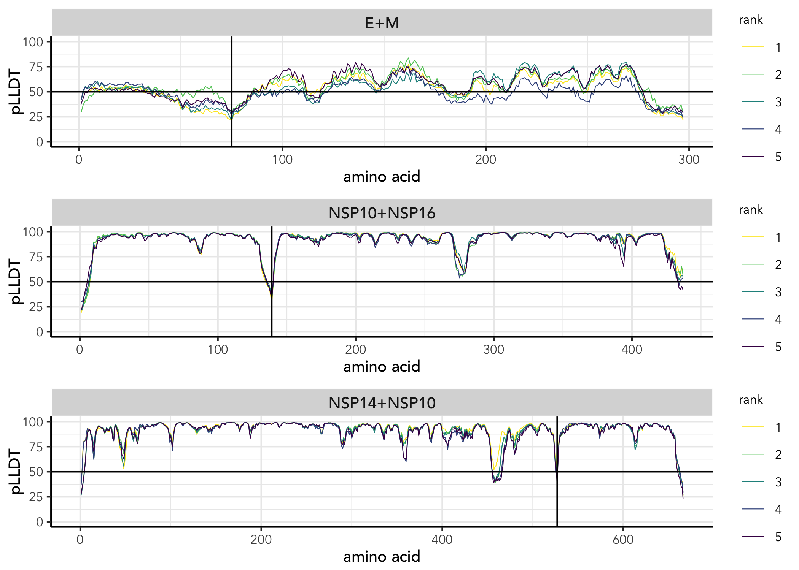

<!-- README.md is generated from README.Rmd. Please edit that file -->

# AFM-PISA-classifier

<!-- badges: start -->

[](https://lifecycle.r-lib.org/articles/stages.html#experimental)

<!-- badges: end -->

The AFM-PISA-classifier package uses AlphaFold-Multimer (AFM)
predictions of the human reference set of positive and random protein
interactions (hsPRS-v2, hsRRS-v2) from ‘Choi, S.G., Olivet, J.,
Cassonnet, P. et al. *Nat Communications* (2019)’ as training set to
predict the likelihood of AFM predictions of interest to be
true-positive interactions. For this, the AFM predicted structures are
analyzed using the PDBePISA tool for the exploration of macromolecular
interfaces. As training features, the PAE values from the AFM
predictions and interface areas retrieved by PDBePISA are used.

## Installation

For some plots XQuartz is required, which can be downloaded from
[XQuartz](https://www.xquartz.org/). You can install the development
version of AFM-PISA-classifier from
[GitHub](https://github.com/philipptrepte/AFM-PISA-classifier) with:

``` r
# Install dependencies
install.packages("BiocManager")
BiocManager::install("ComplexHeatmap")
BiocManager::install("Biostrings")
BiocManager::install("BiocStyle")

devtools::install_github("philipptrepte/binary-PPI-classifier")

# Install AFMpisa
devtools::install_github("philipptrepte/AFM-Pisa-classifier")
```

## Requirements

### AlphaFold-Multimer (AFM) predictions

Predict protein complexes with AlphaFold-Multimer using for example
[AlphaFold](https://github.com/google-deepmind/alphafold) or
[ColabFold](https://colab.research.google.com/github/sokrypton/ColabFold/blob/main/AlphaFold2.ipynb).
Results for each predicted model will include ‘.json’ files containing
the PAE values.

### Protein Interfaces, surfaces and assemblies (PISA)

Use [PDBePISA](https://www.ebi.ac.uk/pdbe/pisa/) or
[PisaPy](https://github.com/hocinebib/PisaPy) for batch analysis of AFM
predictions to extract information on macromolecular interfaces. Results
will include ‘\[…\]interfacesummary0.xml’ and ‘\[…\]interfacetable.xml’
files. Among others, the *interfacesummary* contains information on the
‘Interface Area’ and ‘Number of Interface Residues’, while the
*interfacetable* contains information on the ‘Total Surface Area’, the
‘Solvation Free Energy’, ‘H-Bonds’, ‘Saltbridges’, ‘Disulfide Bonds’ and
‘Complexation Significance Score (CSS)’.

### Binary PPI-classifier

Evaluation of AFM predicted structural models, requires the
[binaryPPIclassifier](https://github.com/philipptrepte/binary-PPI-classifier)
package. To evaluate the predicted models, you can either train a
multi-adaptive support vector machine learning (maSVM) algorithm on your
own training data, or use the provided models, which can be found in the
`/data/maSVM_models/` folder. The provided models were generated by
training the maSVM algorithm on AFM predicted structural models from 51
known interactions and 67 random protein pairs not known to interact.

## Usage

### import.afm()

The function `import.afm()` will import all .json files in the specified
directory `dir` where your save the results from the AFM predictions.
PAE, pLLDT and PTM values will be extracted and stored in a list.

In the following, we provide an example for the AFM predicted structural
models for the NSP10-NSP16 and NSP10-NSP14 complexes.

``` r
YOUR_AFM_RESULTS <- import.afm(dir = "data/AFM_json/")
#> read AFM `config.json` files: 1 of 3
#> read AFM `*scores.json` files: 1 of 15
#> extract ptm, plldt and pae values: 1 of 15
#> Done.
#> extract ptm, plldt and pae values: 1 of 15
#> Done.
#> read `*.a3m` files: 1 of 3
#> read `*.a3m` files: 3 of 3
```

#### Protein information

The list will contain a data frame providing you with an overview of the
predicted protein complexes:

``` r
head(YOUR_AFM_RESULTS$protein)
#>   A_length B_length A_protein B_protein
#> 1       75      222         E         M
#> 2      139      298     NSP10     NSP16
#> 3      527      139     NSP14     NSP10
```

#### pLLDT

It also contains a vector with pLLDT values for every amino acid:

``` r
YOUR_AFM_RESULTS$plldt$`NSP10-NSP16_3cd38.result/NSP10_NSP16_3cd38_unrelaxed_rank_1_model_3_scores.json`
#>   [1] 19.07 22.83 28.73 31.85 34.60 41.77 45.49 59.83 68.14 85.21 84.39 85.99
#>  [13] 92.89 94.01 91.93 92.82 96.17 94.03 94.74 95.75 94.84 96.28 97.28 97.10
#>  [25] 97.11 97.60 97.92 96.96 96.12 95.75 95.66 95.89 95.46 94.40 93.67 94.37
#>  [37] 96.53 96.69 94.67 94.92 98.07 98.71 98.78 98.75 98.47 96.32 96.04 96.50
#>  [49] 95.86 96.01 95.48 96.37 97.41 98.22 98.32 97.83 96.48 96.63 97.98 97.36
#>  [61] 97.92 97.28 95.65 96.37 98.02 98.34 98.78 98.89 98.82 98.58 97.53 98.18
#>  [73] 98.50 97.56 97.48 95.81 95.25 95.54 94.31 90.71 92.39 91.32 92.79 89.33
#>  [85] 84.07 79.61 78.16 77.42 84.43 93.18 92.44 97.04 95.63 96.24 97.78 98.66
#>  [97] 98.84 98.73 98.53 97.98 97.17 96.49 97.24 96.73 96.02 97.60 98.44 98.36
#> [109] 97.99 98.23 97.79 96.89 95.63 96.47 94.54 96.18 96.08 93.59 93.93 95.10
#> [121] 96.29 97.31 97.23 95.24 92.36 93.59 89.21 91.61 87.72 87.09 70.62 60.53
#> [133] 55.81 51.93 49.06 45.46 43.69 38.55 28.60 44.57 64.90 75.27 83.50 90.52
#> [145] 94.97 97.80 97.73 97.98 98.25 98.54 97.77 96.67 97.23 97.80 96.61 95.69
#> [157] 95.30 97.26 96.28 95.23 95.25 93.43 93.13 94.21 94.91 95.40 92.35 92.97
#> [169] 92.60 91.83 93.37 89.20 88.00 92.76 95.41 94.13 93.28 94.25 97.37 96.99
#> [181] 96.43 97.43 98.61 98.45 98.41 98.84 98.82 98.63 98.87 98.87 98.55 98.55
#> [193] 98.70 98.25 97.42 97.72 96.88 98.12 98.71 98.67 97.85 95.83 94.56 97.76
#> [205] 98.37 98.74 98.40 98.68 98.37 97.50 97.64 95.57 92.76 88.08 90.49 92.63
#> [217] 96.66 97.91 98.56 98.72 98.75 98.76 98.87 98.90 98.47 98.41 98.69 98.55
#> [229] 97.43 94.63 93.68 96.93 97.12 97.91 97.36 97.37 96.64 95.70 91.54 88.52
#> [241] 89.63 93.12 94.93 96.81 97.56 97.36 95.10 93.00 94.35 94.08 93.19 90.92
#> [253] 91.91 92.52 91.51 90.92 91.39 90.77 91.49 90.62 94.98 97.57 98.43 98.75
#> [265] 98.94 98.92 98.90 98.77 98.01 96.40 88.48 82.82 75.17 74.94 67.76 64.45
#> [277] 62.63 61.50 60.46 66.06 79.78 87.93 89.37 90.76 90.37 89.29 87.54 94.42
#> [289] 96.56 96.24 96.25 97.79 98.39 98.06 98.01 98.64 98.29 97.38 97.96 98.73
#> [301] 98.68 98.70 98.81 98.90 98.97 98.97 98.97 98.92 98.79 97.95 96.55 94.92
#> [313] 93.89 94.79 96.34 97.30 98.26 98.37 98.76 98.68 98.61 98.76 98.78 98.59
#> [325] 98.73 98.83 98.60 98.16 98.64 98.72 98.84 98.83 98.33 98.10 97.24 97.30
#> [337] 96.56 96.71 96.56 95.07 95.37 97.24 98.57 98.89 98.90 98.94 98.93 98.78
#> [349] 98.83 98.86 98.24 95.91 94.66 95.44 95.49 95.52 96.99 98.02 98.13 98.22
#> [361] 97.79 98.28 98.61 98.43 98.43 98.71 98.45 97.86 97.97 98.26 97.69 96.93
#> [373] 96.23 93.63 90.77 93.19 91.85 95.51 95.59 96.13 95.29 96.45 97.17 94.23
#> [385] 91.15 95.20 92.10 94.26 97.68 97.71 98.21 95.62 88.42 87.96 91.60 97.21
#> [397] 97.44 97.73 97.27 96.24 95.14 92.31 88.39 92.03 95.07 95.45 96.19 96.34
#> [409] 97.36 97.67 97.76 97.99 98.40 98.51 98.38 97.99 98.41 98.44 98.61 98.58
#> [421] 98.53 96.87 93.61 86.76 84.11 82.29 83.25 79.39 79.53 76.29 78.37 60.20
#> [433] 65.61 59.12 54.24 64.36 57.44
```

#### PAE matrix

It also contains a matrix with PAE values for every amino acid pair.
Only the first 20 amino acids are shown:

``` r
YOUR_AFM_RESULTS$pae$`NSP10-NSP16_3cd38.result/NSP10_NSP16_3cd38_unrelaxed_rank_1_model_3_scores.json`[1:20,1:20]
#>        [,1]  [,2]  [,3]  [,4]  [,5]  [,6]  [,7]  [,8]  [,9] [,10] [,11] [,12]
#>  [1,]  0.75  1.49  4.12  5.94  7.65 11.52 13.78 15.38 17.86 17.29 19.35 17.79
#>  [2,]  1.96  0.75  1.25  3.80  6.29  8.62 10.77 13.07 14.73 15.19 17.10 15.42
#>  [3,]  4.49  2.26  0.75  1.38  4.45  6.70  7.83  9.96 11.75 13.09 14.27 13.40
#>  [4,]  6.38  3.91  1.96  0.75  1.46  4.70  6.99  8.18 10.84 12.76 13.07 12.52
#>  [5,]  7.80  5.67  4.15  2.03  0.75  1.39  4.81  6.53  8.88 10.29 10.76 10.47
#>  [6,] 10.26  8.07  6.84  4.86  2.14  0.75  1.40  4.20  6.79  7.18  7.85  8.31
#>  [7,] 13.47 10.40  8.23  6.64  4.72  2.00  0.75  1.20  4.28  5.53  6.21  6.29
#>  [8,] 15.51 13.27 10.44  8.62  7.50  3.97  1.59  0.75  1.02  3.08  4.06  4.18
#>  [9,] 17.18 15.48 14.16 11.67  9.81  6.78  3.65  1.57  0.75  1.98  2.22  2.81
#> [10,] 20.81 18.85 16.31 13.97 11.05  9.37  5.80  4.16  1.87  0.75  0.90  1.96
#> [11,] 20.19 17.87 13.75 12.95 10.99  7.78  6.51  5.57  3.60  1.17  0.75  0.84
#> [12,] 23.05 19.03 17.56 15.17 13.45 10.08  8.81  6.31  4.90  2.64  1.21  0.75
#> [13,] 24.92 22.75 20.58 17.90 14.31 11.22  9.42  6.40  4.21  2.84  2.28  0.86
#> [14,] 24.33 23.00 20.28 17.76 14.75 11.31  9.97  8.56  4.65  2.77  2.57  1.76
#> [15,] 25.13 23.17 19.51 17.94 17.20 13.02 12.20  9.73  6.56  3.25  2.18  1.79
#> [16,] 26.31 24.78 22.70 20.80 18.53 14.84 14.65 10.92  7.13  4.17  2.40  1.66
#> [17,] 27.25 25.64 24.26 22.79 19.18 14.70 13.89 11.62  5.79  4.91  3.64  2.10
#> [18,] 27.10 25.45 23.53 22.32 20.41 15.39 15.20 13.87  7.41  5.60  3.74  2.76
#> [19,] 27.85 26.49 24.40 23.60 23.10 19.83 17.79 16.49 10.69  5.46  4.34  3.25
#> [20,] 28.50 27.20 25.26 24.14 22.97 18.94 17.93 14.96  8.76  6.12  4.15  2.66
#>       [,13] [,14] [,15] [,16] [,17] [,18] [,19] [,20]
#>  [1,] 17.31 17.72 17.64 17.67 17.34 18.04 18.17 18.77
#>  [2,] 15.57 15.87 15.48 15.56 15.33 16.07 15.99 16.87
#>  [3,] 13.56 13.75 13.36 13.38 13.44 14.20 14.09 14.70
#>  [4,] 12.34 12.60 12.26 12.04 12.28 12.77 12.92 13.39
#>  [5,] 10.19 10.57 10.31  9.99 10.11 10.66 10.93 11.07
#>  [6,]  8.16  8.94  8.16  7.98  7.81  8.21  8.95  8.79
#>  [7,]  6.13  6.49  6.58  6.11  6.23  6.43  6.97  6.21
#>  [8,]  3.99  4.25  4.02  3.89  4.06  4.46  4.79  4.47
#>  [9,]  2.85  2.77  2.57  2.86  2.97  3.38  3.89  3.52
#> [10,]  1.63  1.86  1.64  1.84  1.94  2.25  2.81  2.96
#> [11,]  1.39  1.50  1.50  1.84  1.63  1.99  2.66  2.50
#> [12,]  0.83  1.02  1.51  1.28  1.39  1.79  2.57  2.17
#> [13,]  0.75  0.76  1.01  1.09  0.98  1.22  1.94  1.73
#> [14,]  0.79  0.75  0.77  0.99  0.98  1.08  1.57  1.56
#> [15,]  1.07  0.78  0.75  0.78  0.90  1.13  1.50  1.56
#> [16,]  1.16  0.95  0.82  0.75  0.77  1.01  1.60  1.41
#> [17,]  1.14  1.01  1.03  0.79  0.75  0.77  1.17  1.19
#> [18,]  1.32  1.08  1.14  1.03  0.78  0.75  0.80  1.10
#> [19,]  1.82  1.41  1.44  1.27  1.03  0.78  0.75  0.80
#> [20,]  1.72  1.49  1.46  1.27  1.07  1.04  0.86  0.75
```

#### PTM and max PAE

It also contains a data frame on the PTM and max PAE values:

``` r
YOUR_AFM_RESULTS$ptm
#>                                                                               file
#> 1                  E-M_53cd1.result/E_M_53cd1_unrelaxed_rank_1_model_2_scores.json
#> 2                  E-M_53cd1.result/E_M_53cd1_unrelaxed_rank_2_model_4_scores.json
#> 3                  E-M_53cd1.result/E_M_53cd1_unrelaxed_rank_3_model_1_scores.json
#> 4                  E-M_53cd1.result/E_M_53cd1_unrelaxed_rank_4_model_3_scores.json
#> 5                  E-M_53cd1.result/E_M_53cd1_unrelaxed_rank_5_model_5_scores.json
#> 6  NSP10-NSP16_3cd38.result/NSP10_NSP16_3cd38_unrelaxed_rank_1_model_3_scores.json
#> 7  NSP10-NSP16_3cd38.result/NSP10_NSP16_3cd38_unrelaxed_rank_2_model_2_scores.json
#> 8  NSP10-NSP16_3cd38.result/NSP10_NSP16_3cd38_unrelaxed_rank_3_model_1_scores.json
#> 9  NSP10-NSP16_3cd38.result/NSP10_NSP16_3cd38_unrelaxed_rank_4_model_5_scores.json
#> 10 NSP10-NSP16_3cd38.result/NSP10_NSP16_3cd38_unrelaxed_rank_5_model_4_scores.json
#> 11 NSP14-NSP10_c009a.result/NSP14_NSP10_c009a_unrelaxed_rank_1_model_1_scores.json
#> 12 NSP14-NSP10_c009a.result/NSP14_NSP10_c009a_unrelaxed_rank_2_model_2_scores.json
#> 13 NSP14-NSP10_c009a.result/NSP14_NSP10_c009a_unrelaxed_rank_3_model_5_scores.json
#> 14 NSP14-NSP10_c009a.result/NSP14_NSP10_c009a_unrelaxed_rank_4_model_4_scores.json
#> 15 NSP14-NSP10_c009a.result/NSP14_NSP10_c009a_unrelaxed_rank_5_model_3_scores.json
#>     ptm max_pae
#> 1  0.41   31.75
#> 2  0.41   31.75
#> 3  0.37   31.75
#> 4  0.36   31.75
#> 5  0.42   31.75
#> 6  0.92   31.75
#> 7  0.92   31.75
#> 8  0.92   31.75
#> 9  0.92   31.75
#> 10 0.92   31.75
#> 11 0.90   31.75
#> 12 0.89   31.75
#> 13 0.89   31.75
#> 14 0.88   31.75
#> 15 0.88   31.75
```

#### Number of AFM Models

And finally the number of models predicted by AFM for each protein pair:

``` r
YOUR_AFM_RESULTS$num_models
#> [1] 5 5 5
```

### import.pisa()

The function `import.pisa()` will import from all subdirectoris under
the specified directory `dir` the `interfacesummary0.xml` and
`interfacetable.xml` files that you saved from the PDBePISA results.
Information on ‘Interface Area’, ‘Number of Interface Residues’, ‘Total
Surface Area’, ‘Solvation Free Energy’, ‘H-Bonds’, ‘Saltbridges’,
‘Disulfide Bonds’ and ‘Complexation Significance Score (CSS)’ will be
extracted and stored in a data frame.

In the following, we provide an example on the information extracted
from the PDBePISA analyzed AFM predicted structural models of the E-M,
NSP10-NSP16 and NSP10-NSP14 complexes.

``` r
YOUR_PISA_INTERFACE <- import.pisa(dir = "data/PDBePISA_xml/")

YOUR_PISA_INTERFACE
#> # A tibble: 15 × 17
#>    complex   model  rank surfaceAreaA surfaceAreaB interfaceAreaA interfaceAreaB
#>    <chr>     <dbl> <dbl>        <dbl>        <dbl>          <dbl>          <dbl>
#>  1 E_M           2     1        7810.       17071.          1333.          1306.
#>  2 E_M           4     2        7917.       16348           1021.           913.
#>  3 E_M           1     3        7629.       17173.          1053.           918.
#>  4 E_M           3     4        7878.       17654.          1001.          1068.
#>  5 E_M           5     5        7641.       16512.           810.           764.
#>  6 NSP10_NS…     3     1        8915.       14330.           986.           923.
#>  7 NSP10_NS…     2     2        8919.       14331            974.           902.
#>  8 NSP10_NS…     1     3        8706.       14215.          1162.          1094.
#>  9 NSP10_NS…     5     4        8750.       14314.          1263.          1193.
#> 10 NSP10_NS…     4     5        8766.       14186.          1202.          1110.
#> 11 NSP14_NS…     1     1       26445.        8903.          2176.          2364.
#> 12 NSP14_NS…     2     2       26911.        8903.          2239.          2378.
#> 13 NSP14_NS…     5     3       26758.        8890.          2178.          2313.
#> 14 NSP14_NS…     4     4       26800.        8901.          2180.          2406.
#> 15 NSP14_NS…     3     5       27026.        8867.          2131.          2286.
#> # ℹ 10 more variables: interfaceResiduesA <dbl>, interfaceResiduesB <dbl>,
#> #   deltaG <dbl>, pvalue <dbl>, hbonds <dbl>, saltbridges <dbl>,
#> #   disulfide <dbl>, css <dbl>, interfaceArea <dbl>, surfaceArea <dbl>
```

### plldt.lineplot()

This function plots the pLLDT values for each amino acid of an AFM
predicted structural model. You need to specify which complex to plot
`afm_complex = "NSP10-NSP16"` and which rank `afm_rank = 1` or
`afm_rank = "all"`.

``` r
plot_grid(
  plldt.lineplot(import_afm = YOUR_AFM_RESULTS, afm_complex = "E-M", afm_rank = 'all'),
  plldt.lineplot(import_afm = YOUR_AFM_RESULTS, afm_complex = "NSP10-NSP16", afm_rank = 'all'),
  plldt.lineplot(import_afm = YOUR_AFM_RESULTS, afm_complex = "NSP14-NSP10", afm_rank = 'all'),
  ncol = 1
)
```



### pae.heatmap()

The function pae.heatmap() lets you visualize the intra- and
inter-residue PAE values from your AFM predicted structural models. You
can specify which AFM model to plot by providing the rank, and to only
plot the kmeans clustered interface region for which you can set a pLLDT
cutoff that defines which amino acids to include during kmeans
clustering. When clustering the interface region, a barplot will be
plotted, showing the average PAE values from the resulting eight
clusters.

#### E-M complex without interface clustering

``` r
pae.heatmap(import_afm = YOUR_AFM_RESULTS, afm_complex = "E-M", afm_rank = 1, interface_cluster = FALSE)
```


#### E-M complex with interface clustering

Note that we used here a pLLDT of 0 \`plldt = 0’ as cutoff.

``` r
pae.heatmap(import_afm = YOUR_AFM_RESULTS, afm_complex = "E-M", afm_rank = 1, interface_cluster = TRUE, plldt = 0)
#> pae mean of stats::kmeans-clustering: 1 of 15
#> pae mean of stats::kmeans-clustering: 10 of 15
#> Done.
```


#### NSP10-NSP16 complex without interface clustering

``` r
pae.heatmap(import_afm = YOUR_AFM_RESULTS, afm_complex = "NSP10-NSP16", afm_rank = 1, interface_cluster = FALSE)
```


#### NSP10-NSP16 complex with interface clustering

Note that we used here a pLLDT of 50 \`plldt = 50’ as cutoff.

``` r
pae.heatmap(import_afm = YOUR_AFM_RESULTS, afm_complex = "NSP10-NSP16", afm_rank = 1, interface_cluster = TRUE, plldt = 50)
#> pae mean of stats::kmeans-clustering: 1 of 15
#> pae mean of stats::kmeans-clustering: 10 of 15
#> Done.
```


#### NSP14-NSP10 complex without interface clustering

``` r
pae.heatmap(import_afm = YOUR_AFM_RESULTS, afm_complex = "NSP14-NSP10", afm_rank = 1, interface_cluster = FALSE)
```


#### NSP14-NSP10 complex with interface clustering

Note that we used here a pLLDT of 50 \`plldt = 50’ as cutoff.

``` r
pae.heatmap(import_afm = YOUR_AFM_RESULTS, afm_complex = "NSP14-NSP10", afm_rank = 1, interface_cluster = TRUE, plldt = 50)
#> pae mean of stats::kmeans-clustering: 1 of 15
#> pae mean of stats::kmeans-clustering: 10 of 15
#> Done.
```


### pae.interface()

This function performs kmeans clustering to identify amino acid clusters
with the lowest average PAE. This is equivalent to the results from the
`pae.heatmap()` function with the parameter `interface_cluster = TRUE`.
The function takes the resulting list from `import.afm()` as input and
produces a data frame as output, which stores for the resulting eight
clusters (AB cluster 1-4 and BA cluster 1-4) information on their median
and mean PAE values as well as the cluster size as
`number of residues protein A * number of residues protein B`. Note that
we used a pLLDT cutoff of \>50 for all complexes now `plldt = 50`.

``` r
YOUR_INTERFACE <- pae.interface(import_afm = YOUR_AFM_RESULTS, plldt = 50)
#> pae mean of stats::kmeans-clustering: 1 of 15
#> pae mean of stats::kmeans-clustering: 10 of 15
#> Done.
```

``` r
colnames(YOUR_INTERFACE)
#>  [1] "A_length"                "B_length"               
#>  [3] "A_protein"               "B_protein"              
#>  [5] "file"                    "complex"                
#>  [7] "model"                   "rank"                   
#>  [9] "interAB.cluster1.median" "interAB.cluster1.mean"  
#> [11] "interAB.cluster1.size"   "interAB.cluster2.median"
#> [13] "interAB.cluster2.mean"   "interAB.cluster2.size"  
#> [15] "interAB.cluster3.median" "interAB.cluster3.mean"  
#> [17] "interAB.cluster3.size"   "interAB.cluster4.median"
#> [19] "interAB.cluster4.mean"   "interAB.cluster4.size"  
#> [21] "interBA.cluster1.median" "interBA.cluster1.mean"  
#> [23] "interBA.cluster1.size"   "interBA.cluster2.median"
#> [25] "interBA.cluster2.mean"   "interBA.cluster2.size"  
#> [27] "interBA.cluster3.median" "interBA.cluster3.mean"  
#> [29] "interBA.cluster3.size"   "interBA.cluster4.median"
#> [31] "interBA.cluster4.mean"   "interBA.cluster4.size"  
#> [33] "pae"                     "interaction"

YOUR_INTERFACE %>% dplyr::select(A_length, B_length, A_protein, B_protein, complex, model, rank, pae)
#> # A tibble: 15 × 8
#>    A_length B_length A_protein B_protein complex     model  rank   pae
#>       <dbl>    <dbl> <chr>     <chr>     <chr>       <dbl> <dbl> <dbl>
#>  1       75      222 E         M         E_M             2     1 15.3 
#>  2       75      222 E         M         E_M             4     2 16.3 
#>  3       75      222 E         M         E_M             1     3 17.8 
#>  4       75      222 E         M         E_M             3     4 15.2 
#>  5       75      222 E         M         E_M             5     5 19.0 
#>  6      139      298 NSP10     NSP16     NSP10_NSP16     3     1  3.77
#>  7      139      298 NSP10     NSP16     NSP10_NSP16     2     2  3.30
#>  8      139      298 NSP10     NSP16     NSP10_NSP16     1     3  3.87
#>  9      139      298 NSP10     NSP16     NSP10_NSP16     5     4  3.42
#> 10      139      298 NSP10     NSP16     NSP10_NSP16     4     5  3.69
#> 11      527      139 NSP14     NSP10     NSP14_NSP10     1     1  4.29
#> 12      527      139 NSP14     NSP10     NSP14_NSP10     2     2  4.28
#> 13      527      139 NSP14     NSP10     NSP14_NSP10     5     3  4.27
#> 14      527      139 NSP14     NSP10     NSP14_NSP10     4     4  4.36
#> 15      527      139 NSP14     NSP10     NSP14_NSP10     3     5  4.37
```

### pae.boxplot()

The function `pae.boxplot()` will plot the lowest average PAE values
from the eight clusters. Each dot represents an AFM predicted structural
model, which typically predicts five models.

``` r
pae.boxplot(pae_interface = YOUR_INTERFACE)
```


### afm.pisa.heatmap()

The function `afm.pisa.heatmap()` will plot for all complex, the minimum
average PAE from the eight clusters, and the PDBePISA calculated
solvation free energy (𝚫G), interface area and surface area for all AFM
predicted structural models (typically five per complex).

``` r
afm.pisa.heatmap(import_afm = YOUR_AFM_RESULTS, import_pisa = YOUR_PISA_INTERFACE)
#> pae mean of stats::kmeans-clustering: 1 of 15
#> pae mean of stats::kmeans-clustering: 10 of 15
#> Done.
```


## Evaluate AFM structural models for likelihood of interaction

If you provide your own reference set, follow the instructiosn of the
[binaryPPIclassifier](https://github.com/philipptrepte/binary-PPI-classifier)
package.

You can also predict the interaction probability of your AFM predicted
structural complexes using the maSVM models provided herein, which were
trained on 51 known interactions and 67 random protein pairs not known
to interact (hsPRS-AF and hsRRS-AF).

### Load Models

``` r
data("AFM_maSVM_models")
```

### Prepare data

``` r
YOUR_TEST_SET <- YOUR_PISA_INTERFACE %>%
  left_join(YOUR_INTERFACE %>%
              dplyr::select(A_protein, B_protein, complex, model, rank, pae),
            by = c("complex" = "complex", "rank" = "rank", "model" = "model")) %>%
  dplyr::mutate(deltaG = -deltaG, #invert deltaG
                pae = 40-pae) %>% #invert PAE
  # adjust columns to meet the binary-PPI-classifier input requirements
  dplyr::mutate(Donor = paste(A_protein, rank, sep = "_"), 
                Donor_tag = "NA", 
                Donor_protein = A_protein,
                Acceptor = paste(B_protein, rank, sep = "_"), 
                Acceptor_tag = "NA", 
                Acceptor_protein = B_protein,
                complex = "Covid",
                reference = "NA",
                interaction = paste0(A_protein, " + ", B_protein),
                sample = paste0(A_protein, "+", B_protein, "_"),
                orientation = paste0(Donor_tag, rank, "+", Acceptor_tag, rank)) %>%
  pivot_longer(cols = c(interfaceArea, deltaG, pae), 
               names_to = "data", values_to = "score")

YOUR_TEST_SET %>% dplyr::select(complex, interaction, orientation, data, score)
#> # A tibble: 45 × 5
#>    complex interaction orientation data           score
#>    <chr>   <chr>       <chr>       <chr>          <dbl>
#>  1 Covid   E + M       NA1+NA1     interfaceArea 1319. 
#>  2 Covid   E + M       NA1+NA1     deltaG          27.2
#>  3 Covid   E + M       NA1+NA1     pae             24.7
#>  4 Covid   E + M       NA2+NA2     interfaceArea  967. 
#>  5 Covid   E + M       NA2+NA2     deltaG          20.1
#>  6 Covid   E + M       NA2+NA2     pae             23.7
#>  7 Covid   E + M       NA3+NA3     interfaceArea  986. 
#>  8 Covid   E + M       NA3+NA3     deltaG          13.9
#>  9 Covid   E + M       NA3+NA3     pae             22.2
#> 10 Covid   E + M       NA4+NA4     interfaceArea 1034. 
#> # ℹ 35 more rows
```

``` r
TEST_MAT <- YOUR_TEST_SET %>% 
  tidyr::unite(complex, interaction, sample, orientation, col = "sample", sep = ";") %>%
  tidyr::pivot_wider(names_from = data, values_from = score) %>% 
  dplyr::filter(across(.cols = c('interfaceArea', 'pae'), ~!is.na(.x))) %>% 
  tibble::column_to_rownames("sample") %>% 
  dplyr::select(c('interfaceArea', 'pae')) %>%
  base::as.matrix()

TEST_MAT
#>                                          interfaceArea      pae
#> Covid;E + M;E+M_;NA1+NA1                     1319.1750 24.67004
#> Covid;E + M;E+M_;NA2+NA2                      967.4365 23.67244
#> Covid;E + M;E+M_;NA3+NA3                      985.7920 22.18190
#> Covid;E + M;E+M_;NA4+NA4                     1034.4300 24.76735
#> Covid;E + M;E+M_;NA5+NA5                      787.0985 21.04642
#> Covid;NSP10 + NSP16;NSP10+NSP16_;NA1+NA1      954.7190 36.23047
#> Covid;NSP10 + NSP16;NSP10+NSP16_;NA2+NA2      937.9400 36.69947
#> Covid;NSP10 + NSP16;NSP10+NSP16_;NA3+NA3     1128.0500 36.13220
#> Covid;NSP10 + NSP16;NSP10+NSP16_;NA4+NA4     1227.7250 36.58069
#> Covid;NSP10 + NSP16;NSP10+NSP16_;NA5+NA5     1155.9700 36.31416
#> Covid;NSP14 + NSP10;NSP14+NSP10_;NA1+NA1     2269.7900 35.70924
#> Covid;NSP14 + NSP10;NSP14+NSP10_;NA2+NA2     2308.5450 35.71643
#> Covid;NSP14 + NSP10;NSP14+NSP10_;NA3+NA3     2245.2000 35.73414
#> Covid;NSP14 + NSP10;NSP14+NSP10_;NA4+NA4     2293.1800 35.64153
#> Covid;NSP14 + NSP10;NSP14+NSP10_;NA5+NA5     2208.7600 35.62514
```

### Predict Interaction Probability

``` r
prediction <- data.frame()
for(i in 1:length(AFM_maSVM_models)) {
  tmp <- attr(stats::predict(AFM_maSVM_models[[i]], newdata = TEST_MAT,
                      decision.values = TRUE, probability = TRUE), "probabilities")
  tmp <- tmp %>% 
    as.data.frame() %>%
    rownames_to_column("id") %>%
    tidyr::separate(col = "id", 
                    into = c("complex", "interaction", "sample", "orientation"), 
                    sep = ";")
  tmp <- cbind(tmp,i)
  prediction <- rbind(prediction, tmp)
  rm(tmp)
}

YOUR_AFM_PREDICTIONS <- prediction %>%
  group_by(interaction, orientation) %>%
  dplyr::summarise(probability = mean(`2`))
#> `summarise()` has grouped output by 'interaction'. You can override using the
#> `.groups` argument.

YOUR_AFM_PREDICTIONS
#> # A tibble: 15 × 3
#> # Groups:   interaction [3]
#>    interaction   orientation probability
#>    <chr>         <chr>             <dbl>
#>  1 E + M         NA1+NA1           0.792
#>  2 E + M         NA2+NA2           0.617
#>  3 E + M         NA3+NA3           0.512
#>  4 E + M         NA4+NA4           0.715
#>  5 E + M         NA5+NA5           0.346
#>  6 NSP10 + NSP16 NA1+NA1           0.985
#>  7 NSP10 + NSP16 NA2+NA2           0.986
#>  8 NSP10 + NSP16 NA3+NA3           0.989
#>  9 NSP10 + NSP16 NA4+NA4           0.992
#> 10 NSP10 + NSP16 NA5+NA5           0.990
#> 11 NSP14 + NSP10 NA1+NA1           0.998
#> 12 NSP14 + NSP10 NA2+NA2           0.998
#> 13 NSP14 + NSP10 NA3+NA3           0.998
#> 14 NSP14 + NSP10 NA4+NA4           0.998
#> 15 NSP14 + NSP10 NA5+NA5           0.997
```

## Reference

<u>**AI-guided pipeline for protein–protein interaction drug discovery
identifies a SARS-CoV-2 inhibitor**</u>

Trepte P, Secker C, Olivet J, Blavier J, Kostova S, Maseko SB, Minia I,
Ramos ES, Cassonnet P, Golusik S, et al (2024) AI-guided pipeline for
protein–protein interaction drug discovery identifies a SARS-CoV-2
inhibitor. Mol Syst Biol: 1–30

<https://doi.org/10.1038/s44320-024-00019-8>

## License

Distributed under the MIT License. See `License.md` for more
information.

## Contact

Philipp Trepte - <philipp.trepte@imba.oeaw.ac.at> -
[LinkedIn](https://www.linkedin.com/in/philipp-trepte/)

AFM-PISA-classifier:
<https://github.com/philipptrepte/AFM-PISA-classifier>

## Session Info

``` r
sessionInfo()
#> R version 4.3.2 (2023-10-31)
#> Platform: aarch64-apple-darwin20 (64-bit)
#> Running under: macOS Sonoma 14.4
#> 
#> Matrix products: default
#> BLAS:   /Library/Frameworks/R.framework/Versions/4.3-arm64/Resources/lib/libRblas.0.dylib 
#> LAPACK: /Library/Frameworks/R.framework/Versions/4.3-arm64/Resources/lib/libRlapack.dylib;  LAPACK version 3.11.0
#> 
#> locale:
#> [1] en_US.UTF-8/en_US.UTF-8/en_US.UTF-8/C/en_US.UTF-8/en_US.UTF-8
#> 
#> time zone: Europe/Berlin
#> tzcode source: internal
#> 
#> attached base packages:
#> [1] grid      stats4    stats     graphics  grDevices utils     datasets 
#> [8] methods   base     
#> 
#> other attached packages:
#>  [1] knitr_1.45                  DT_0.32                    
#>  [3] AFMpisa_1.0.2.0             xml2_1.3.6                 
#>  [5] ComplexHeatmap_2.18.0       Biostrings_2.70.3          
#>  [7] GenomeInfoDb_1.38.8         XVector_0.42.0             
#>  [9] IRanges_2.36.0              S4Vectors_0.40.2           
#> [11] BiocGenerics_0.48.1         rjson_0.2.21               
#> [13] binaryPPIclassifier_1.5.5.8 plotly_4.10.4              
#> [15] dplyr_1.1.4                 viridis_0.6.5              
#> [17] viridisLite_0.4.2           varhandle_2.0.6            
#> [19] usethis_2.2.3               tidyr_1.3.1                
#> [21] tibble_3.2.1                stringr_1.5.1              
#> [23] Rmisc_1.5.1                 plyr_1.8.9                 
#> [25] rlang_1.1.3                 randomForest_4.7-1.1       
#> [27] purrr_1.0.2                 plotROC_2.3.1              
#> [29] ggpubr_0.6.0                ggnewscale_0.4.10          
#> [31] e1071_1.7-14                DescTools_0.99.54          
#> [33] cowplot_1.1.3               caret_6.0-94               
#> [35] lattice_0.22-6              ggplot2_3.5.0              
#> 
#> loaded via a namespace (and not attached):
#>   [1] RColorBrewer_1.1-3      rstudioapi_0.15.0       jsonlite_1.8.8         
#>   [4] shape_1.4.6.1           magrittr_2.0.3          magick_2.8.3           
#>   [7] farver_2.1.1            rmarkdown_2.26          GlobalOptions_0.1.2    
#>  [10] fs_1.6.3                zlibbioc_1.48.2         vctrs_0.6.5            
#>  [13] Cairo_1.6-2             RCurl_1.98-1.14         rstatix_0.7.2          
#>  [16] htmltools_0.5.7         broom_1.0.5             cellranger_1.1.0       
#>  [19] pROC_1.18.5             parallelly_1.37.1       htmlwidgets_1.6.4      
#>  [22] rootSolve_1.8.2.4       lubridate_1.9.3         lifecycle_1.0.4        
#>  [25] iterators_1.0.14        pkgconfig_2.0.3         Matrix_1.6-5           
#>  [28] R6_2.5.1                fastmap_1.1.1           clue_0.3-65            
#>  [31] GenomeInfoDbData_1.2.11 future_1.33.1           digest_0.6.35          
#>  [34] Exact_3.2               colorspace_2.1-0        labeling_0.4.3         
#>  [37] fansi_1.0.6             timechange_0.3.0        httr_1.4.7             
#>  [40] abind_1.4-5             compiler_4.3.2          proxy_0.4-27           
#>  [43] withr_3.0.0             doParallel_1.0.17       backports_1.4.1        
#>  [46] carData_3.0-5           highr_0.10              ggsignif_0.6.4         
#>  [49] MASS_7.3-60.0.1         lava_1.8.0              gld_2.6.6              
#>  [52] ModelMetrics_1.2.2.2    tools_4.3.2             future.apply_1.11.1    
#>  [55] nnet_7.3-19             glue_1.7.0              nlme_3.1-164           
#>  [58] cluster_2.1.6           reshape2_1.4.4          generics_0.1.3         
#>  [61] recipes_1.0.10          gtable_0.3.4            class_7.3-22           
#>  [64] data.table_1.15.2       lmom_3.0                car_3.1-2              
#>  [67] utf8_1.2.4              foreach_1.5.2           pillar_1.9.0           
#>  [70] circlize_0.4.16         splines_4.3.2           survival_3.5-8         
#>  [73] tidyselect_1.2.1        gridExtra_2.3           xfun_0.42              
#>  [76] expm_0.999-9            hardhat_1.3.1           timeDate_4032.109      
#>  [79] matrixStats_1.2.0       stringi_1.8.3           lazyeval_0.2.2         
#>  [82] yaml_2.3.8              boot_1.3-30             evaluate_0.23          
#>  [85] codetools_0.2-19        cli_3.6.2               rpart_4.1.23           
#>  [88] munsell_0.5.0           Rcpp_1.0.12             readxl_1.4.3           
#>  [91] globals_0.16.3          png_0.1-8               parallel_4.3.2         
#>  [94] assertthat_0.2.1        gower_1.0.1             bitops_1.0-7           
#>  [97] listenv_0.9.1           mvtnorm_1.2-4           ipred_0.9-14           
#> [100] scales_1.3.0            prodlim_2023.08.28      crayon_1.5.2           
#> [103] GetoptLong_1.0.5
```
